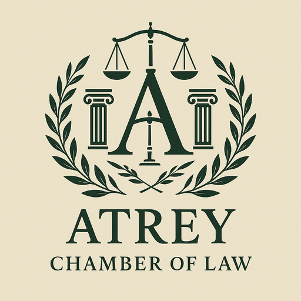

<p align="center">
  
</p>

<h1 align="center">Atrey Chambers of Law LLP</h1>

<p align="center">
  <strong>The Official Website of Dr. Abhishek Atrey's Premier Indian Law Firm</strong>
</p>

<p align="center">
  <a href="https://atreychambers.com">atreychambers.com</a> &nbsp;|&nbsp;
  <a href="https://atreychambers.vercel.app">Vercel Mirror</a>
</p>

<p align="center">
  
  
  
  
  
  
  
  
</p>

---

## About Dr. Abhishek Atrey — Founder & Managing Partner


**Dr. Abhishek Atrey** (LL.D., LL.M., LL.B., B.Sc.) is a distinguished **Supreme Court Advocate** and **Advocate-on-Record (AoR)** with nearly **three decades** of exceptional legal practice across India's highest courts and tribunals.

- **Enrolled as Advocate**: 1997
- **Designated Advocate-on-Record**: Supreme Court of India, 2006
- **'A' Panel Counsel for Government of India**: Supreme Court (since 2014)
- **Standing Counsel**: Government of Uttarakhand at Supreme Court (since 2007)
- **Standing Counsel**: MoEFCC at National Green Tribunal (2015–2018)
- **Panel Counsel**: Association of Indian Universities — SC & Delhi HC (since 2020)
- **Senior Panel Counsel**: CAQM — Delhi HC & NGT (since 2022)
- **Vice President**: Supreme Court Young Lawyer's Forum
- **President**: Dard Se Hamdard Tak (NGO for welfare of poor prisoners)
- **National Convenor**: VHP Legal Cell (Vidhi Prakoshtha)

### Landmark Achievements

| Category | Details |
|----------|---------|
| **Years of Practice** | 29+ years before Supreme Court, High Courts, NGT & Tribunals |
| **Cases Argued** | 500+ cases across constitutional, environmental, criminal & civil law |
| **Books Authored** | 3 — including *"Law of Witnesses"* with foreword by Hon'ble Justice T.S. Thakur |
| **Articles Published** | 20+ in India Legal Magazine, Dainik Jagran, Nyay Pravah & India Legal Live |
| **TV Appearances** | 30+ on Rajya Sabha TV, Sansad TV, Lok Sabha TV, APN News |
| **Awards** | Nyaymurti Prem Shankar Gupt Hindi Sahitya Samman (2021) |

### Published Books

1. **Law of Writs, Practice & Procedure** — Kamal Publishers, New Delhi (2014)
2. **Law of Witnesses: Role of Witnesses in Criminal Justice System, A Need to Reform** — Kamal Publishers, New Delhi (2015) — *Foreword by Hon'ble Mr. Justice T.S. Thakur, Supreme Court of India*
3. **Yadein (यादें)** — Hindi Poetry Collection (2019)

### Media & Television

Dr. Atrey is a recognized legal commentator on matters of national importance, with regular appearances on:

- **Rajya Sabha TV / Sansad TV** — *Desh Deshantar*, *Law of the Land*, *Big Picture*, *Aapka Kanoon*, *Policy Watch*, *Bills and Acts*
- **Lok Sabha TV** — *Nyay Chakra*
- **APN News** — *Loktantra*, *Legal Helpline*, *Mudda*
- **News India** — *Murder Mystery*

### Contact

- **Office**: 24, Gyan Kunj, Basement, Laxmi Nagar, Delhi — 110092
- **Phone**: +91-11-22053080 | +91-11-22023821
- **Email**: support@atreychambers.com
- **Website**: [https://atreychambers.com](https://atreychambers.com)

---

## About the Firm

**Atrey Chambers of Law LLP** is a premier full-service Indian law firm established under the Limited Liability Partnership Act, 2008. The firm represents the Government of India, State Governments, public sector undertakings, major institutions, and private clients in matters before the Supreme Court of India, High Courts, National Green Tribunal, and various tribunals across the country.

### Partners

| Name | Role | Designation | Degrees |
|------|------|-------------|---------|
| **Dr. Abhishek Atrey** | Founder & Managing Partner | Advocate-on-Record, Supreme Court of India | LL.D., LL.M., LL.B., B.Sc. |
| **Mrs. Ambika Atrey** | Partner | Advocate, Bar Council of Delhi | M.Com., LL.M. |
| **Aniruddh Atrey** | Director of Technology | AI Engineer & Cybersecurity Specialist | M.S. (CS), B.Tech (CSE) |

---

## Website Overview

A **production-grade**, **fully responsive** law firm website featuring cinematic animations, 3D visual effects, dynamic content management, structured data for SEO, accessibility best practices, and a comprehensive admin panel.

### Key Highlights

- **32 Practice Area Pages** — dynamically generated from data
- **42+ Pages** total across the site (30 public + 12 CMS)
- **65+ Components** — 43 website + 22 CMS components
- **11 API Routes** (website) + **35+ API endpoints** (CMS backend)
- **Full Mobile Responsiveness** — optimized for 320px to 4K screens
- **Cinematic Page Transitions** — GSAP-powered block reveal animations
- **3D Visual Effects** — Three.js particle backgrounds
- **Smooth Scrolling** — Lenis scroll engine
- **Admin CMS** — manage resources & testimonials
- **ATREY CMS** — full Case Management System with 208+ cases, RBAC, auto-fetch from courts
- **SEO Optimized** — JSON-LD structured data, OpenGraph, LLMs.txt
- **Security Hardened** — CSRF, rate limiting, input sanitization, security headers

---

## Pages & Routes (30+ Pages)

### Public Pages

| # | Route | Page | Description |
|---|-------|------|-------------|
| 1 | `/` | Home | Hero with animated tagline, services grid, stats, testimonials, awards marquee, newsletter |
| 2 | `/our-firm` | Our Firm | Firm overview, history, values, mission |
| 3 | `/our-team` | Our Team | Team member cards with profiles |
| 4 | `/our-team/abhishek-atrey` | Dr. Abhishek Atrey | Detailed attorney profile — bio, cases, books, articles, media |
| 5 | `/our-team/ambika-atrey` | Mrs. Ambika Atrey | Partner profile — education, experience, practice areas |
| 6 | `/our-team/aniruddh-atrey` | Aniruddh Atrey | Technology director profile — certifications, publications, skills |
| 7 | `/practice-area` | Practice Areas | All 32 practice area cards with icons |
| 8 | `/practice-area/[slug]` | Practice Area Detail | **32 dynamic pages** — Constitutional Law, Supreme Court Litigation, Environmental Law, Criminal Law, etc. |
| 9 | `/contact` | Contact | Contact form, info cards, Google Maps embed |
| 10 | `/schedule` | Schedule Consultation | Date picker, time slots, email notifications |
| 11 | `/our-clients` | Our Clients | Client showcase and testimonials |
| 12 | `/testimonials` | Testimonials | Published client testimonials |
| 13 | `/awards` | Awards & Recognition | Awards marquee showcase |
| 14 | `/publications` | Publications | Books, articles, media gallery |
| 15 | `/resources` | Resources Hub | Resource categories portal |
| 16 | `/resources/legal-books` | Legal Books | Published books library |
| 17 | `/resources/research-articles` | Research Articles | Academic articles collection |
| 18 | `/resources/legal-posts-blogs` | Legal Posts & Blogs | Blog posts and legal commentary |
| 19 | `/resources/news-telecast` | News Telecasts | TV appearance videos |
| 20 | `/legal-insights` | Legal Insights | Legal analysis and commentary |
| 21 | `/our-blog` | Blog | Blog listing page |
| 22 | `/features` | Features | Firm capabilities showcase |
| 23 | `/careers` | Careers | Job openings and application info |
| 24 | `/faq` | FAQ | Frequently asked questions with expandable answers |
| 25 | `/privacy-policy` | Privacy Policy | Data privacy and cookie policy |
| 26 | `/terms-of-service` | Terms of Service | Legal terms and conditions |
| 27 | `/signin` | Sign In | Admin authentication portal |
| 28 | `/profile` | User Profile | Authenticated user profile |

### Admin Panel

| # | Route | Page | Description |
|---|-------|------|-------------|
| 29 | `/admin` | Admin Dashboard | Content management hub |
| 30 | `/admin/resources` | Manage Resources | CRUD for books, articles, posts, telecasts — rich text editor, image upload |
| 31 | `/admin/testimonials` | Manage Testimonials | CRUD for client testimonials — publish/unpublish toggle |

### Special Pages

| # | Route | Description |
|---|-------|-------------|
| 32 | `404` | Custom not-found page |
| 33 | `loading` | Global loading spinner |

> **Total: 30 static pages + 32 dynamic practice area pages + 12 CMS pages = 74+ unique pages**

---

## Tech Stack & Architecture

### Core Framework

| Technology | Version | Purpose |
|------------|---------|---------|
| **Next.js** | 14.2.5 | App Router, SSR/SSG, API routes, file-based routing |
| **React** | 18.3.1 | UI component library |
| **TypeScript** | 5.6.3 | Type safety across the entire codebase |
| **Tailwind CSS** | 3.4.14 | Utility-first styling with custom design tokens |

### Animation & 3D

| Technology | Version | Purpose |
|------------|---------|---------|
| **GSAP** | 3.14.2 | Cinematic page transitions, scroll animations, stagger effects |
| **Framer Motion** | 11.18.2 | Component-level animations, layout transitions |
| **Three.js** | r181 | 3D particle backgrounds, WebGL effects |
| **@react-three/fiber** | 8.18 | React renderer for Three.js |
| **@react-three/drei** | 10.7.7 | Three.js helpers and abstractions |
| **Lenis** | 1.3.17 | Smooth scroll engine |

### Backend & APIs

| Technology | Purpose |
|------------|---------|
| **Next.js API Routes** | Server-side endpoints for auth, CRUD, email |
| **Nodemailer** | Email notifications for consultation scheduling |
| **Google APIs** | Google Sheets integration for data storage |
| **@vercel/blob** | File upload storage for images |
| **React Quill** | Rich text editor for admin CMS |

### Security

| Feature | Implementation |
|---------|---------------|
| **CSRF Protection** | Token-based cross-site request forgery prevention |
| **Rate Limiting** | Request throttling on API endpoints |
| **Input Sanitization** | HTML/XSS sanitization on all user inputs |
| **Security Headers** | HSTS, X-Content-Type-Options, X-Frame-Options, X-XSS-Protection, CSP, Referrer-Policy |
| **Authentication** | Session-based admin authentication |

### Design System

| Token | Value | Usage |
|-------|-------|-------|
| **Deep Green** | `#0E3B2F` | Primary brand color, headings, CTA |
| **Cream** | `#F2EBDD` | Background, light surfaces |
| **Gold** | `#B8860B` | Accents, highlights, decorative elements |
| **Charcoal** | `#333333` | Body text, secondary elements |
| **Playfair Display** | Serif | Headlines, display typography |
| **DM Sans** | Sans-serif | Body text, UI elements |
| **Cormorant Garamond** | Serif | Accents, italicized quotes |

---

## File Structure

```
Website-main/
├── README.md                                # This file
├── package.json                             # Root workspace config
├── tsconfig.json                            # Root TypeScript config
│
└── frontend-next/                           # Next.js Application
    ├── app/                                 # Next.js App Router
    │   ├── layout.tsx                       # Root layout — fonts, metadata, providers
    │   ├── page.tsx                         # Home page
    │   ├── loading.tsx                      # Global loading state
    │   ├── not-found.tsx                    # Custom 404 page
    │   ├── opengraph-image.tsx              # Dynamic OG image generation
    │   ├── globals.css                      # Global styles (1216 lines)
    │   │
    │   ├── admin/                           # Admin panel (website content)
    │   │   ├── layout.tsx                   # Admin layout (no page transitions)
    │   │   ├── page.tsx                     # Dashboard
    │   │   ├── resources/
    │   │   │   └── page.tsx                 # Resource management CMS
    │   │   └── testimonials/
    │   │       └── page.tsx                 # Testimonial management CMS
    │   │
    │   ├── case-management/                 # ATREY CMS — Case Management System (12 pages)
    │   │   ├── layout.tsx                   # CMS layout (auth check + header + nav)
    │   │   ├── login/page.tsx               # CMS login (separate from website admin)
    │   │   ├── dashboard/page.tsx           # 6 stat cards, charts, widgets
    │   │   ├── cases/page.tsx               # Case table — filters, search, sort, inline edit
    │   │   ├── cases/[id]/page.tsx          # Case detail — 27 fields, history, compliance
    │   │   ├── hearings/page.tsx            # Hearing diary — urgency badges, print view
    │   │   ├── calendar/page.tsx            # Monthly calendar with case pills
    │   │   ├── compliance/page.tsx          # Compliance tracker with status tabs
    │   │   ├── filings/page.tsx             # Filings table + Kanban board
    │   │   ├── auto-fetch/page.tsx          # SCI scraper status, conflict resolution
    │   │   ├── users/page.tsx               # User CRUD, permissions, password reset
    │   │   ├── audit/page.tsx               # Full audit trail — who did what, when
    │   │   └── settings/page.tsx            # Export/import, system info, danger zone
    │   │
    │   ├── api/                             # Server-side API routes (11 endpoints)
    │   │   ├── auth/
    │   │   │   ├── login/route.ts           # Admin login endpoint
    │   │   │   ├── logout/route.ts          # Session logout
    │   │   │   └── session/route.ts         # Session validation
    │   │   ├── contact/route.ts             # Contact form submission
    │   │   ├── schedule/route.ts            # Consultation scheduling + email
    │   │   ├── resources/
    │   │   │   ├── route.ts                 # CRUD for resources
    │   │   │   ├── publish/route.ts         # Publish/unpublish toggle
    │   │   │   └── published/route.ts       # Public published resources
    │   │   ├── testimonials/
    │   │   │   ├── route.ts                 # CRUD for testimonials
    │   │   │   └── published/route.ts       # Public published testimonials
    │   │   └── upload/route.ts              # Image upload to Vercel Blob
    │   │
    │   ├── awards/
    │   │   ├── layout.tsx
    │   │   └── page.tsx                     # Awards & recognition
    │   ├── careers/
    │   │   └── page.tsx                     # Careers page
    │   ├── contact/
    │   │   ├── layout.tsx
    │   │   └── page.tsx                     # Contact form + map
    │   ├── faq/
    │   │   ├── layout.tsx
    │   │   └── page.tsx                     # FAQ with expandable answers
    │   ├── features/
    │   │   └── page.tsx                     # Firm capabilities
    │   ├── legal-insights/
    │   │   └── page.tsx                     # Legal commentary
    │   ├── our-blog/
    │   │   └── page.tsx                     # Blog listing
    │   ├── our-clients/
    │   │   ├── layout.tsx
    │   │   └── page.tsx                     # Client showcase
    │   ├── our-firm/
    │   │   ├── layout.tsx
    │   │   └── page.tsx                     # Firm overview
    │   ├── our-team/
    │   │   ├── page.tsx                     # Team listing
    │   │   ├── abhishek-atrey/
    │   │   │   ├── layout.tsx
    │   │   │   └── page.tsx                 # Dr. Abhishek Atrey profile
    │   │   ├── ambika-atrey/
    │   │   │   ├── layout.tsx
    │   │   │   └── page.tsx                 # Mrs. Ambika Atrey profile
    │   │   └── aniruddh-atrey/
    │   │       ├── layout.tsx
    │   │       └── page.tsx                 # Aniruddh Atrey profile
    │   ├── practice-area/
    │   │   ├── layout.tsx
    │   │   ├── page.tsx                     # All practice areas grid
    │   │   └── [slug]/
    │   │       └── page.tsx                 # Dynamic practice area detail (32 pages)
    │   ├── privacy-policy/
    │   │   └── page.tsx                     # Privacy policy
    │   ├── profile/
    │   │   ├── layout.tsx
    │   │   └── page.tsx                     # User profile
    │   ├── publications/
    │   │   ├── layout.tsx
    │   │   └── page.tsx                     # Publications & media
    │   ├── resources/
    │   │   ├── page.tsx                     # Resources hub
    │   │   ├── legal-books/
    │   │   │   └── page.tsx                 # Legal books
    │   │   ├── legal-posts-blogs/
    │   │   │   └── page.tsx                 # Blog posts
    │   │   ├── news-telecast/
    │   │   │   └── page.tsx                 # TV appearances
    │   │   └── research-articles/
    │   │       └── page.tsx                 # Research articles
    │   ├── schedule/
    │   │   └── page.tsx                     # Consultation scheduling
    │   ├── signin/
    │   │   ├── layout.tsx
    │   │   └── page.tsx                     # Admin sign-in
    │   ├── terms-of-service/
    │   │   └── page.tsx                     # Terms of service
    │   └── testimonials/
    │       └── page.tsx                     # Client testimonials
    │
    ├── components/                          # Reusable UI Components (43+)
    │   ├── Header.tsx                       # Navigation bar with mobile menu
    │   ├── Footer.tsx                       # Site footer with links & social
    │   ├── Hero.tsx                         # Animated hero section with tagline ticker
    │   ├── AboutUs.tsx                      # About section with stats
    │   ├── AttorneyProfile.tsx              # Detailed attorney profile template
    │   ├── AwardsMarquee.tsx                # Infinite scroll awards ticker
    │   ├── BCIDisclaimer.tsx                # Bar Council of India disclaimer modal
    │   ├── BluePolygon.tsx                  # Decorative SVG polygon
    │   ├── BookCard.tsx                     # Book display card
    │   ├── CTAButton.tsx                    # Call-to-action button
    │   ├── DecorativeDots.tsx               # Dot pattern decoration
    │   ├── FeaturesSection.tsx              # Features grid
    │   ├── HowWeWork.tsx                    # Process/workflow section
    │   ├── LandmarkCases.tsx                # Notable cases showcase
    │   ├── LayoutProviders.tsx              # Context providers wrapper
    │   ├── LegalInsights.tsx                # Legal insights cards
    │   ├── LegalParticles.tsx               # Particle animation overlay
    │   ├── MediaGallery.tsx                 # Media/photo gallery
    │   ├── Newsletter.tsx                   # Newsletter signup
    │   ├── NewsGrid.tsx                     # News articles grid
    │   ├── PageTransition.tsx               # GSAP block reveal transitions
    │   ├── PublishedResourcesList.tsx        # Dynamic resources list with modal
    │   ├── ResourceCard.tsx                 # Resource display card
    │   ├── ResourcesLayout.tsx              # Resources page layout wrapper
    │   ├── RevolvingIcons.tsx               # Animated revolving icons
    │   ├── ScheduleForm.tsx                 # Consultation booking form
    │   ├── ScrollHint.tsx                   # Scroll indicator arrow
    │   ├── Section.tsx                      # Reusable page section
    │   ├── ServicesGrid.tsx                 # Practice areas grid with flip cards
    │   ├── SmoothScroll.tsx                 # Lenis smooth scroll provider
    │   ├── StatsSection.tsx                 # Animated number counters
    │   ├── TechBackground.tsx               # Three.js 3D background
    │   ├── TestimonialsCarousel.tsx          # Testimonials slider
    │   │
    │   ├── cms/                              # ATREY CMS Components (22 files)
    │   │   ├── layout/                      # CmsHeader, CmsNavTabs, CmsLayoutShell
    │   │   ├── dashboard/                   # StatCardsRow, UpcomingHearings, Overdue, Activity, Charts
    │   │   ├── cases/                       # CaseTable, CaseFilters, AddCaseModal, CasePagination
    │   │   └── ui/                          # CmsStatCard, CmsBadge, CmsButton, CmsModal, CmsTable, etc.
    │   │
    │   └── ui/                              # Atomic UI primitives
    │       ├── 3d-card.tsx                  # 3D tilt card effect
    │       ├── Badge.tsx                    # Status badge
    │       ├── Breadcrumbs.tsx              # Navigation breadcrumbs
    │       ├── Divider.tsx                  # Section divider
    │       ├── GlassCard.tsx                # Glassmorphism card
    │       ├── Lightbox.tsx                 # Image lightbox modal
    │       ├── mouse-follower.tsx           # Custom cursor follower
    │       ├── NumberTicker.tsx             # Animated number counter
    │       ├── ScrollProgress.tsx           # Scroll progress indicator
    │       ├── ScrollReveal.tsx             # Scroll-triggered reveal animation
    │       ├── SectionHeading.tsx           # Styled section heading
    │       └── StaggerGrid.tsx              # Staggered grid animation
    │
    ├── hooks/                               # Custom React Hooks
    │   └── useScrollTimeline.ts             # Scroll-linked animation timeline
    │
    ├── lib/                                 # Utilities & Data Layer
    │   ├── animations.ts                    # GSAP animation presets
    │   ├── auth.ts                          # Authentication helpers
    │   ├── csrf.ts                          # CSRF token generation/validation
    │   ├── rate-limit.ts                    # API rate limiting
    │   ├── sanitize.ts                      # Input sanitization (XSS prevention)
    │   ├── schema.ts                        # JSON-LD structured data generators
    │   ├── theme.ts                         # Design tokens (colors, typography)
    │   ├── utils.ts                         # Utility functions (assetPath, cn, etc.)
    │   ├── cms-types.ts                      # CMS TypeScript interfaces (17 enums, 8 models, 5 constants)
    │   ├── cms-api.ts                       # CMS API client (11 service objects, 40+ methods, mock fallback)
    │   └── data/                            # Static data stores
    │       ├── careers.ts                   # Job listings data
    │       ├── faq.ts                       # FAQ questions & answers
    │       ├── practice-areas.ts            # 32 practice areas (slug, title, description, key matters)
    │       ├── publications.ts              # Publications data
    │       ├── team.ts                      # Team member profiles
    │       └── seed-cases.ts                # 85 real Supreme Court cases (UK AA list)
    │
    ├── public/                              # Static Assets
    │   ├── logo.png                         # Firm logo
    │   ├── dr-abhishek-atrey.jpg            # Dr. Atrey's photo
    │   ├── aniruddh-atrey.png               # Aniruddh Atrey's photo
    │   ├── og-image-logo.png                # OpenGraph share image
    │   ├── favicon.ico                      # Browser favicon
    │   ├── favicon-16x16.png                # 16px favicon
    │   ├── favicon-32x32.png                # 32px favicon
    │   ├── apple-touch-icon.png             # iOS home screen icon
    │   ├── icon-192x192.png                 # Android/PWA icon
    │   ├── icon-512x512.png                 # PWA splash icon
    │   ├── manifest.json                    # PWA web manifest
    │   └── llms.txt                         # LLM-readable site description
    │
    ├── next.config.mjs                      # Next.js config — security headers, basePath
    ├── tailwind.config.js                   # Tailwind config — custom design tokens
    ├── tsconfig.json                        # TypeScript configuration
    ├── postcss.config.js                    # PostCSS config
    └── package.json                         # Dependencies & scripts
```

---

## 32 Practice Areas

Every practice area has its own dynamically generated page with detailed descriptions, key matters, related articles, and structured data.

<details>
<summary><strong>Click to expand all 32 practice areas</strong></summary>

| # | Practice Area | Route |
|---|--------------|-------|
| 1 | Constitutional Law & PIL | `/practice-area/constitutional-law-pil` |
| 2 | Supreme Court Litigation (AOR) | `/practice-area/supreme-court-litigation` |
| 3 | High Court Litigation | `/practice-area/high-court-litigation` |
| 4 | Environmental Law & NGT | `/practice-area/environmental-law-ngt` |
| 5 | Government & Public Sector Litigation | `/practice-area/government-litigation` |
| 6 | Criminal Law & Defense | `/practice-area/criminal-law` |
| 7 | Civil & Commercial Litigation | `/practice-area/civil-commercial-litigation` |
| 8 | Arbitration & ADR | `/practice-area/arbitration-adr` |
| 9 | Corporate & Commercial Law | `/practice-area/corporate-commercial-law` |
| 10 | Insolvency & Bankruptcy | `/practice-area/insolvency-bankruptcy` |
| 11 | Temple Rights & Religious Law | `/practice-area/temple-rights-religious-law` |
| 12 | Real Estate & Property Law | `/practice-area/real-estate-property` |
| 13 | Waqf & Property Law | `/practice-area/waqf-property-law` |
| 14 | Family Law | `/practice-area/family-law` |
| 15 | Taxation Law | `/practice-area/taxation-law` |
| 16 | Employment & Labour Law | `/practice-area/employment-labour-law` |
| 17 | Air Quality & Environmental Regulation | `/practice-area/air-quality-regulation` |
| 18 | University & Education Law | `/practice-area/university-education-law` |
| 19 | Intellectual Property | `/practice-area/intellectual-property` |
| 20 | Consumer Protection | `/practice-area/consumer-protection` |
| 21 | Banking & Finance Law | `/practice-area/banking-finance-law` |
| 22 | Competition & Antitrust | `/practice-area/competition-antitrust` |
| 23 | Media & Entertainment Law | `/practice-area/media-entertainment-law` |
| 24 | Customs & Foreign Trade | `/practice-area/customs-foreign-trade` |
| 25 | Matrimonial Law & Divorce | `/practice-area/matrimonial-law-divorce` |
| 26 | Cyber Law & Data Protection | `/practice-area/cyber-law-data-protection` |
| 27 | Immigration Law | `/practice-area/immigration-law` |
| 28 | Human Rights Law | `/practice-area/human-rights-law` |
| 29 | Election Law | `/practice-area/election-law` |
| 30 | Land Acquisition (LARR) | `/practice-area/land-acquisition-larr` |
| 31 | Defense & Military Law | `/practice-area/defense-military-law` |
| 32 | White Collar Crime | `/practice-area/white-collar-crime` |

</details>

---

## Architecture Diagram

```
┌─────────────────────────────────────────────────────────────┐
│                        CLIENT BROWSER                        │
│  ┌─────────┐  ┌──────────┐  ┌─────────┐  ┌──────────────┐  │
│  │  React  │  │  GSAP    │  │ Three.js│  │Framer Motion │  │
│  │  18.3   │  │  3.14    │  │  r181   │  │    11.18     │  │
│  └────┬────┘  └────┬─────┘  └────┬────┘  └──────┬───────┘  │
│       │            │             │               │           │
│  ┌────┴────────────┴─────────────┴───────────────┴────────┐ │
│  │              Next.js 14 App Router                      │ │
│  │  ┌──────────┐  ┌──────────┐  ┌────────────────────┐   │ │
│  │  │  Pages   │  │Components│  │   Layouts & Providers │ │ │
│  │  │  (30+)   │  │  (43+)   │  │  (PageTransition,   │  │ │
│  │  │          │  │          │  │   SmoothScroll,      │  │ │
│  │  │          │  │          │  │   LayoutProviders)   │  │ │
│  │  └──────────┘  └──────────┘  └────────────────────┘   │ │
│  └────────────────────────┬──────────────────────────────┘  │
└───────────────────────────┼─────────────────────────────────┘
                            │ API Calls
┌───────────────────────────┼─────────────────────────────────┐
│                     SERVER (Vercel)                           │
│  ┌────────────────────────┴──────────────────────────────┐  │
│  │              Next.js API Routes (11)                   │  │
│  │  ┌────────┐  ┌──────────┐  ┌─────────┐  ┌─────────┐ │  │
│  │  │  Auth  │  │ Resources│  │Schedule │  │ Upload  │  │  │
│  │  │(login, │  │  (CRUD,  │  │(booking,│  │(Vercel  │  │  │
│  │  │logout, │  │ publish) │  │ email)  │  │  Blob)  │  │  │
│  │  │session)│  │          │  │         │  │         │  │  │
│  │  └────────┘  └──────────┘  └─────────┘  └─────────┘ │  │
│  └───────────────────────────────────────────────────────┘  │
│                                                              │
│  ┌──────────────┐  ┌──────────────┐  ┌──────────────────┐  │
│  │   Security   │  │  Data Layer  │  │   External APIs  │  │
│  │  ┌────────┐  │  │  ┌────────┐  │  │  ┌────────────┐  │  │
│  │  │ CSRF   │  │  │  │Practice│  │  │  │Google Sheets│ │  │
│  │  │ Rate   │  │  │  │Areas   │  │  │  │(data store) │ │  │
│  │  │ Limit  │  │  │  │(32)    │  │  │  └────────────┘  │  │
│  │  │Sanitize│  │  │  │Team(3) │  │  │  ┌────────────┐  │  │
│  │  │Headers │  │  │  │FAQ     │  │  │  │ Nodemailer  │ │  │
│  │  └────────┘  │  │  │Careers │  │  │  │(SMTP email) │ │  │
│  └──────────────┘  │  └────────┘  │  │  └────────────┘  │  │
│                    └──────────────┘  │  ┌────────────┐  │  │
│                                      │  │Vercel Blob  │ │  │
│                                      │  │(file store) │ │  │
│                                      │  └────────────┘  │  │
│                                      └──────────────────┘  │
└──────────────────────────────────────────────────────────────┘
```

---

## SEO & Performance

### Structured Data (JSON-LD)

Every page generates appropriate structured data schemas:

- **Organization** — firm name, logo, contact, social profiles
- **LegalService** — practice areas with service descriptions
- **Person** — attorney profiles with credentials
- **ContactPoint** — phone, email, hours
- **BreadcrumbList** — navigation hierarchy
- **WebPage** — page-level metadata
- **FAQPage** — FAQ with question/answer pairs

### SEO Features

- OpenGraph meta tags with dynamic image generation
- Twitter Card meta tags
- Canonical URLs
- XML Sitemap support
- `llms.txt` for AI/LLM discoverability
- Keyword-rich metadata with name variants (Dr. Abhishek Atrey, Mr. Atrey, Abhishek, A. Atrey)
- Comprehensive `robots` meta configuration

### Performance

- Server-side rendering (SSR) for dynamic pages
- Static generation (SSG) for practice area pages
- Image optimization with lazy loading
- Font subsetting with `next/font`
- CSS tree-shaking via Tailwind
- Reduced motion support for accessibility

---

## Getting Started

### Prerequisites

- **Node.js** >= 18
- **npm** >= 9

### Installation

```bash
# Clone the repository
git clone https://github.com/AndrousStark/Atrey-Chambers-of-Law.git

# Navigate to frontend
cd Website-main/frontend-next

# Install dependencies
npm install

# Start development server
npm run dev
```

Open [http://localhost:3000](http://localhost:3000) to view the site.

### Build

```bash
# Production build
npm run build

# Start production server
npm start
```

### Environment Variables

```env
# Google Sheets API (for data storage)
GOOGLE_SHEETS_PRIVATE_KEY=...
GOOGLE_SHEETS_CLIENT_EMAIL=...
GOOGLE_SHEETS_SPREADSHEET_ID=...

# Email (Nodemailer)
SMTP_HOST=...
SMTP_PORT=...
SMTP_USER=...
SMTP_PASS=...

# Vercel Blob (file uploads)
BLOB_READ_WRITE_TOKEN=...

# Admin Authentication
ADMIN_USERNAME=...
ADMIN_PASSWORD=...

# ATREY CMS (Case Management System)
NEXT_PUBLIC_CMS_API_URL=https://cms-api.atreychambers.com
NEXT_PUBLIC_CMS_MOCK=false

# Optional
NEXT_PUBLIC_BASE_PATH=
```

---

## Deployment

The site is deployed on **Vercel** with automatic deployments on push to `main`.

| Environment | URL |
|-------------|-----|
| **Production** | [https://atreychambers.com](https://atreychambers.com) |
| **Vercel** | [https://atreychambers.vercel.app](https://atreychambers.vercel.app) |

### Custom Domains

| Domain | Status |
|--------|--------|
| `atreychambers.com` | Primary |
| `atreychambers.net` | Redirect to .com |
| `atreychambers.co` | Redirect to .com |
| `atreychambers.org` | Redirect to .com |
| `atreychambers.info` | Redirect to .com |

---

## ATREY CMS — Case Management System

A full-featured **Case Management System** integrated into the website at `/case-management/*`, purpose-built for Dr. Abhishek Atrey's legal practice managing **208+ cases** across the Supreme Court of India, High Courts, and Tribunals.

**Live API:** `https://cms-api.atreychambers.com` &nbsp;|&nbsp; **Backend Repo:** [atrey-cms-api](https://github.com/AndrousStark/atrey-cms-api)

### CMS Architecture

```
Frontend (This Repo)                     Backend (atrey-cms-api)
atreychambers.com/case-management/*      cms-api.atreychambers.com/api/v1/*
Next.js 14 + Tailwind CSS               Node.js + Express + Prisma + PostgreSQL 16
Deployed on Vercel                       Deployed on Hetzner VPS (Docker Compose)
```

### CMS Pages (12 Routes)

| # | Route | Page | Description |
|---|-------|------|-------------|
| 1 | `/case-management/login` | Login | Email/password JWT authentication |
| 2 | `/case-management/dashboard` | Dashboard | 6 stat cards, court/dept charts, upcoming hearings, overdue compliance, recent activity |
| 3 | `/case-management/cases` | All Cases | Filterable, sortable, paginated table with inline editing, bulk actions, column visibility |
| 4 | `/case-management/cases/[id]` | Case Detail | All 27 case fields, hearing timeline, compliance items, filings, collapsible sections |
| 5 | `/case-management/hearings` | Hearing Diary | Chronological hearing list, urgency badges, days-left countdown, print view |
| 6 | `/case-management/calendar` | Calendar | Monthly grid with colored case pills, day detail panel, mobile week view |
| 7 | `/case-management/compliance` | Compliance | Status tabs (Pending/InProgress/Overdue/Completed), auto-flagging, mark complete |
| 8 | `/case-management/filings` | Filings | Table view + Kanban board (Not Started → Drafting → Review → Ready → Filed) |
| 9 | `/case-management/auto-fetch` | Auto-Fetch | SCI scraper status, conflict resolution, per-case fetch, schedule info |
| 10 | `/case-management/users` | Users | Create/edit/deactivate users, granular permissions, reset passwords, view activity |
| 11 | `/case-management/audit` | Audit Log | Who did what, when — filterable by user/action/entity, CSV export |
| 12 | `/case-management/settings` | Settings | CSV/JSON export & import, system info, danger zone (superadmin only) |

### CMS Components (22 Components)

```
components/cms/
├── layout/
│   ├── CmsHeader.tsx              # "ATREY CMS" branded header — Made by Aniruddh Atrey
│   ├── CmsNavTabs.tsx             # 10 permission-based navigation tabs
│   └── CmsLayoutShell.tsx         # Auth check wrapper with header + nav
├── dashboard/
│   ├── StatCardsRow.tsx           # 6 KPI cards (active, hearings, compliance, etc.)
│   ├── UpcomingHearingsWidget.tsx  # Next 10 hearings with urgency badges
│   ├── OverdueComplianceWidget.tsx # Overdue items with red highlighting
│   ├── RecentActivityWidget.tsx   # Latest 20 audit log entries
│   └── DistributionCharts.tsx     # Court + department bar charts
├── cases/
│   ├── CaseTable.tsx              # 24-column data table with inline editing + save feedback
│   ├── CaseFilters.tsx            # Multi-dropdown filters (court, status, dept, priority)
│   ├── AddCaseModal.tsx           # Create/edit case form (supports add + edit modes)
│   └── CasePagination.tsx         # Page navigation with size selector
└── ui/
    ├── CmsStatCard.tsx            # Colored left-border stat card
    ├── CmsBadge.tsx               # 10-variant status badge (high, medium, low, active, etc.)
    ├── CmsButton.tsx              # 5-variant button (primary, secondary, danger, success, warning)
    ├── CmsModal.tsx               # Modal overlay with ESC close + body scroll lock
    ├── CmsTable.tsx               # Generic sortable data table
    ├── CmsDropdown.tsx            # Multi-select dropdown with checkboxes
    ├── CmsPagination.tsx          # Page navigation with ellipsis
    ├── CmsSearch.tsx              # Search input with magnifying glass icon
    ├── CmsDatePicker.tsx          # DD.MM.YYYY date input with validation
    ├── CmsEmptyState.tsx          # Empty state placeholder
    └── CmsLoadingState.tsx        # Loading spinner
```

### User Roles & Permissions (19 Granular Permissions)

| Role | Access | Users |
|------|--------|-------|
| **Super Admin** | Full access — all permissions, user management, danger zone | Dr. Abhishek Atrey, Aniruddh Atrey, Aastha Atrey, Ambika Atrey |
| **Editor** | Add/edit cases, compliance, filings — no delete, no user management | Faheem Ahmed, Deepak Rawat, Atul Sharma |
| **Viewer** | Read-only, filtered to their client's cases only | (Client accounts) |

**Permission Categories:**
- Dashboard, Cases (view/add/edit/delete), Hearings, Calendar, Compliance (view/edit), Filings (view/edit), Auto-Fetch (view/trigger), Users (view/edit), Audit, Settings, Export, Import

Super admin can set per-user permissions via checkbox toggles, reset any user's password, and view per-user activity logs.

### Backend API (35+ Endpoints)

**Base URL:** `https://cms-api.atreychambers.com/api/v1`

| Group | Endpoints | Auth |
|-------|-----------|------|
| **Auth** | `POST /auth/login`, `GET /auth/me`, `POST /auth/change-password` | Public / JWT |
| **Cases** | `GET/POST/PUT/DELETE /cases`, `POST /cases/bulk-update` | editor+ / admin |
| **Compliance** | `GET/POST/PUT/DELETE /compliance`, `GET /compliance/by-case/:id` | editor+ / admin |
| **Filings** | `GET/POST/PUT/DELETE /filings`, `GET /filings/by-case/:id` | editor+ / admin |
| **Hearings** | `GET/POST/PUT/DELETE /hearings/by-case/:id` | editor+ / admin |
| **Users** | `GET/POST/PUT/DELETE /users`, `POST /users/:id/reset-password` | admin only |
| **Dashboard** | `GET /dashboard/stats,upcoming-hearings,overdue-compliance,recent-activity` | JWT |
| **Audit** | `GET /audit` (filterable by user/action/entity/date) | admin only |
| **Scraper** | `POST /scraper/fetch-case/:id,fetch-all,fetch-ecourts,fetch-tribunals` | admin only |
| **Scraper Status** | `GET /scraper/status,ecourts-status,tribunal-status,conflicts` | admin only |
| **Export** | `GET /export/csv`, `GET /export/json` | admin only |
| **Import** | `POST /import/json`, `POST /import/csv` | admin only |
| **Health** | `GET /health` | Public |

### Backend Stack

| Layer | Technology |
|-------|-----------|
| Runtime | Node.js 20 LTS |
| Framework | Express.js 4.21 |
| Database | PostgreSQL 16 (Prisma ORM 6.4) |
| Auth | JWT (bcryptjs + jsonwebtoken) |
| Validation | Zod 3.24 |
| Scraping | Puppeteer + Chromium + custom CAPTCHA solver |
| Scheduling | node-cron (4 cron jobs) |
| Security | Helmet, CORS, rate-limiting (100 req/15min) |
| Docker | Docker Compose (api + postgres:16-alpine) |
| SSL | Let's Encrypt via Nginx (auto-renewal) |

### Database Schema (6 Tables)

| Model | Key Fields | Indexes |
|-------|-----------|---------|
| **User** | name, email, passwordHash, role, permissions[], departmentFilter, clientFilter | email (unique) |
| **Case** | caseNo, court, client, petitioner, respondent, status, ndoh, priority, department, remarks + 15 more | status, court, client, dept, ndoh, priority, assignedTo, (caseNo+court unique) |
| **Compliance** | caseId, direction, dueDate, status, assignedTo, completionDate | caseId, status, dueDate |
| **Filing** | caseId, filingType, status, dueDate, filedDate, filingNumber | caseId, status |
| **Hearing** | caseId, hearingDate, courtBench, judge, orderSummary, source | caseId, hearingDate |
| **AuditLog** | userId, action, entityType, entityId, fieldChanged, oldValue, newValue | userId, entityType, timestamp |

### Auto-Fetch Scraper Engine (Phase 2-4)

Automated data fetching from Indian court websites:

| Court | Method | Schedule |
|-------|--------|----------|
| **Supreme Court** (sci.gov.in) | Puppeteer + custom CAPTCHA solver (no Tesseract) | Daily 6AM IST + Weekly Sunday |
| **High Courts** (25 via eCourts) | Kleopatra API + Puppeteer fallback | Weekly Wednesday |
| **District Courts** (700+) | eCourts API | Weekly Wednesday |
| **NCLT** | Puppeteer scraper | Bi-monthly (1st & 15th) |
| **NCLAT** | Puppeteer scraper | Bi-monthly |
| **ITAT** | Puppeteer + CAPTCHA solver | Bi-monthly |
| **NGT** | Puppeteer scraper | Bi-monthly |
| **CAT** | Puppeteer scraper | Bi-monthly |

**CAPTCHA Solver:** Lightweight pixel-analysis engine (~250 lines, `sharp` only — no Tesseract/ML). Detects `+`/`-` operators via structural cross-bar analysis + Zhang-Suen skeleton thinning. Evaluates math expressions (e.g., "3 + 5" → "8").

**Dr. Atrey's AOR Code:** 1601 (hardcoded for SCI bulk fetch)

### CMS Design System

The CMS uses a separate design system from the main website:

| Token | Value | Usage |
|-------|-------|-------|
| Navy | `#1B2A4A` | Header gradient, headings |
| Blue | `#2E5090` | Header gradient end, active tabs |
| Accent | `#4472C4` | Buttons, stat borders, links |
| Background | `#F0F2F5` | Page background |
| Red | `#FF4444` | Urgent, overdue, danger |
| Orange | `#FF8C00` | Warnings |
| Green | `#28A745` | Completed, success |
| Yellow | `#FFC107` | Caution, pending |
| Font | Segoe UI, system-ui | System font (not website fonts) |

### CMS Deployment

| Component | Host | Details |
|-----------|------|---------|
| Frontend | Vercel | Auto-deploys on push to main |
| Backend API | Hetzner VPS (91.98.75.122) | Docker Compose, Nginx reverse proxy |
| Database | PostgreSQL 16 (Docker) | 208 cases, daily backup cron at 2AM IST |
| SSL | Let's Encrypt | `cms-api.atreychambers.com`, auto-renew |
| Domain | `cms-api.atreychambers.com` | A record → 91.98.75.122 |

### E2E Tests (10/10 Passing)

Playwright tests covering: Login, Dashboard, Cases, Navigation, Admin tabs, Users, Invalid login, Auth guard, CMS link, Logout.

---

## License

All rights reserved. &copy; 2025-2026 Atrey Chambers of Law LLP. This codebase is proprietary and confidential.

---

<br/>

<p align="center">
  
</p>

<h2 align="center">Designed & Developed by Aniruddh Atrey</h2>

<p align="center">
  <strong>AI Engineer &middot; Cybersecurity Specialist &middot; Full-Stack Developer &middot; Entrepreneur</strong>
</p>

<p align="center">
  <em>M.S. in Computer Science, University of Florida &middot; B.Tech in CSE, Amity University</em>
</p>

<p align="center">
  This entire website &mdash; from architecture to animations, from backend APIs to pixel-perfect UI, from SEO optimization to security hardening &mdash; was conceptualized, designed, engineered, and deployed by <strong>Aniruddh Atrey</strong>, son of Dr. Abhishek Atrey and Director of Technology at Atrey Chambers of Law LLP.
</p>

<p align="center">
  Aniruddh brings 6+ years of experience across AI/ML engineering, cybersecurity, full-stack development, and cloud architecture. He has secured 50+ government web assets for the Ministry of Defence of India at INNEFU Labs (DRDO), published 3 IEEE / book chapter research papers, and holds 18+ professional certifications from Stanford, Google, Cisco, EC-Council, IBM, and ISO. He is the Co-Founder & COO of F1Jobs.io and Founder & CTO of MetaMinds.
</p>

### Awards & Recognition

| Award | Year |
|-------|------|
| **2025 Webby Awards Winner** &mdash; Best Home Page | 2025 |
| **GSAP Site of the Month** | Oct & Nov 2024 |

### Connect with Aniruddh

<p align="center">

| Platform | Link |
|----------|------|
| **Portfolio** | [aniruddhatrey.com](https://aniruddhatrey.com) |
| **LinkedIn** | [linkedin.com/in/aniruddhatrey](https://linkedin.com/in/aniruddhatrey) |
| **GitHub** | [github.com/AndrousStark](https://github.com/AndrousStark) |
| **Email** | [atreyaniruddh@gmail.com](mailto:atreyaniruddh@gmail.com) |
| **F1Jobs.io** | [f1jobs.io](https://f1jobs.io) |

</p>

### Technical Expertise

```
AI / Machine Learning     ████████████████████  Python, TensorFlow, PyTorch, RAG, LLM, AI Agents
Cybersecurity             ████████████████████  VAPT, OWASP, Pen Testing, MITRE ATT&CK
Full-Stack Development    ████████████████████  React, Next.js, Django, FastAPI, Node.js
Cloud & DevOps            ██████████████████░░  AWS, Docker, Kubernetes, Terraform, CI/CD
UI/UX & Design            ██████████████████░░  Figma, Three.js, GSAP, Framer Motion
```

### Certifications

| Certification | Issuer |
|--------------|--------|
| Machine Learning Specialization | Stanford University |
| Cybersecurity Professional Certificate | Google |
| CCNA Enterprise Networking | Cisco |
| Ethical Hacking Essentials | EC-Council |
| ISO/IEC 27001 Information Security | SkillFront |
| Deep Learning Specialization | DeepLearning.AI |
| AWS Cloud Practitioner Essentials | Amazon Web Services |
| Full-Stack Web Development | Meta |

### Research Publications

1. **Real-Time Temperature Based Food Recommendation using AI** &mdash; IEEE Xplore, 14th ICCCNT, IIT-Delhi (2023)
2. **Urban Digital Twins for Sustainability: Singapore & Indian Smart Cities** &mdash; IEEE Xplore, 2nd Global AI Summit (2025)
3. **Perspective of Cyber Security and Ethical Hacking with VAET** &mdash; Book Chapter, Big Data Analytics Framework (2023)

---

<p align="center">
  <sub>Built with precision, passion, and purpose by <a href="https://aniruddhatrey.com"><strong>Aniruddh Atrey</strong></a></sub>
</p>

<p align="center">
  <sub>&copy; 2025 Atrey Chambers of Law LLP &middot; All Rights Reserved</sub>
</p>
